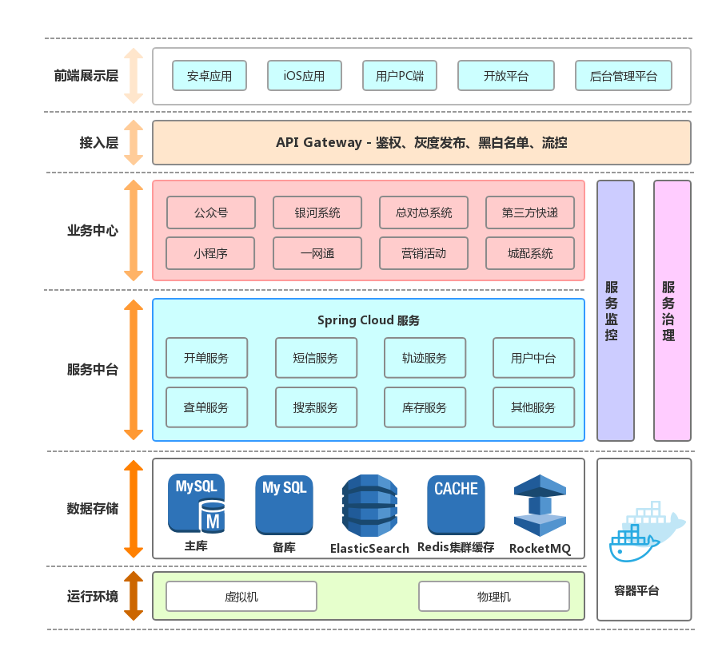

# 简介

Nebula 是分布式敏捷开发系统架构，在 Spring Boot 与 Spring Cloud 基础上做增强不做改变，为简化开发、提高效率、规范开发而生。

> **愿景** 成为微服务开发人员喜爱的、分布式敏捷开发系统框架

# 特性
- **开放：** 拥抱开源，消除技术壁垒，使用主流的开源组件
- **简单：** 开箱即用，不用为搭建各种环境、配置各种xml而烦恼
- **规范：** 车同轨、书同文，降低沟通成本，提高代码传承性
- **高效：** 组件化，减少开发人员手写代码量，提升单兵输出

# 技术选型

#### <a name="backend">后端技术</a>
技术 | 类型 | 官网
----|------|----
Spring Framework | 基础容器  | [http://projects.spring.io/spring-framework/](http://projects.spring.io/spring-framework/)
Spring Boot | 扩展容器 | [http://spring.io/projects/spring-boot](http://spring.io/projects/spring-boot)
Spring Cloud | 微服务框架  | [http://spring.io/projects/spring-cloud](http://spring.io/projects/spring-cloud)
Spring Boot Admin | 微服务管理  | [https://github.com/codecentric/spring-boot-admin](https://github.com/codecentric/spring-boot-admin)
MyBatis | ORM框架  | [http://www.mybatis.org/mybatis-3/zh/index.html](http://www.mybatis.org/mybatis-3/zh/index.html)
TK Mapper | MyBatis插件 | [https://github.com/abel533/Mapper/wiki](https://github.com/abel533/Mapper/wiki)
PageHelper | MyBatis分页插件  | [http://git.oschina.net/free/Mybatis_PageHelper](http://git.oschina.net/free/Mybatis_PageHelper)
Apache Shiro | 安全框架  | [http://shiro.apache.org/](http://shiro.apache.org/)
Pac4j | 安全引擎  | [https://github.com/pac4j/pac4j/](https://github.com/pac4j/pac4j/)
FluentValidator | 校验框架  | [https://github.com/neoremind/fluent-validator](https://github.com/neoremind/fluent-validator)
Apollo | 配置中心 | [https://github.com/ctripcorp/apollo/wiki](https://github.com/ctripcorp/apollo/wiki)
Consul | 注册中心 | [https://www.consul.io/](https://www.consul.io/)
Open Feign | Rest客户端 | [https://github.com/OpenFeign/feign](https://github.com/OpenFeign/feign)
Elastic-Job-Lite | 分布式任务 | [http://elasticjob.io/index_zh.html](http://elasticjob.io/index_zh.html)
ZooKeeper | 分布式协调服务  | [http://zookeeper.apache.org/](http://zookeeper.apache.org/)
HikariCP | 数据库连接池 | [https://github.com/brettwooldridge/HikariCP/wiki](https://github.com/brettwooldridge/HikariCP/wiki)
Sharding-Sphere | 分库分表(开发) | [http://shardingsphere.io/index_zh.html](http://shardingsphere.io/index_zh.html)
MapStruct | Bean 映射 | [http://mapstruct.org/](http://mapstruct.org/)
Guava | Java 基础库 | [https://github.com/google/guava/wiki](https://github.com/google/guava/wiki)
Sequence | ID生成器  | [http://git.oschina.net/yu120/sequence](http://git.oschina.net/yu120/sequence)
Fescar | 分布式事务 | [https://github.com/alibaba/fescar](https://github.com/alibaba/fescar)
Sentinel | 流量控制 | [https://github.com/alibaba/Sentinel](https://github.com/alibaba/Sentinel)
Elasticsearch | 搜索引擎  | [https://www.elastic.co/](https://www.elastic.co/)
Elasticsearch-sql | es-sql  | [https://github.com/NLPchina/elasticsearch-sql/](https://github.com/NLPchina/elasticsearch-sql/)
FreeMarker | 模板引擎  | [https://freemarker.apache.org/](https://freemarker.apache.org/)
RocketMQ | 消息队列 | [http://rocketmq.apache.org/](http://rocketmq.apache.org/) 
Redisson | 分布式缓存  | [https://redisson.org/](https://redisson.org/)
Swagger2 | 接口测试框架  | [http://swagger.io/](http://swagger.io/)
SkyWalking | 全链路跟踪  | [https://skywalking.apache.org//](https://skywalking.apache.org//)
easy-rules | 简单规则引擎  | [https://github.com/j-easy/easy-rules/](https://github.com/j-easy/easy-rules/)
WxJava | 微信开发  | [https://github.com/Wechat-Group/WxJava/](https://github.com/Wechat-Group/WxJava/)
Zuul | 网关 | [https://github.com/Netflix/zuul](https://github.com/Netflix/zuul)
AliOSS | 云存储  | [https://www.aliyun.com/product/oss/](https://www.aliyun.com/product/oss/)
Maven | 项目构建管理  | [http://maven.apache.org/](http://maven.apache.org/)
Netty-socketio | 实时推送  | [https://github.com/mrniko/netty-socketio](https://github.com/mrniko/netty-socketio)
Byte-Buddy | Java字节码  | [https://github.com/raphw/byte-buddy/](https://github.com/raphw/byte-buddy/)
Lombok | Java代码插件  | [https://projectlombok.org/](https://projectlombok.org/)
Maven | 项目构建管理  | [http://maven.apache.org/](http://maven.apache.org/)

#### 前端技术
技术 | 类型 | 官网
----|------|----
VUE | VDom框架 | [https://cn.vuejs.org/](https://cn.vuejs.org/)
es6 | ECMAScript | [http://es6.ruanyifeng.com/](http://es6.ruanyifeng.com/)
vuex | 状态管理 | [https://vuex.vuejs.org/zh/](https://vuex.vuejs.org/zh/)
D2Admin | 前端集成方案 | [https://doc.d2admin.fairyever.com/zh/](https://doc.d2admin.fairyever.com/zh/)
Element-Ui | VUE组件库 | [http://element-cn.eleme.io/#/zh-CN](http://element-cn.eleme.io/#/zh-CN)
axios | Ajax交互 | [https://github.com/axios/axios](https://github.com/axios/axios)
echarts | 图表组件 | [http://echarts.baidu.com/](http://echarts.baidu.com/)
moment | 日期组件 | [http://momentjs.cn/](http://momentjs.cn/)
vscode | 开发工具 | [https://code.visualstudio.com/](https://code.visualstudio.com/)
iceworks | 开发工具 | [https://alibaba.github.io/ice/iceworks](https://alibaba.github.io/ice/iceworks)
AntD | 前端组件库 | [https://ant.design/index-cn/](https://ant.design/index-cn/)
AntD Pro | 中台前端 | [https://pro.ant.design/index-cn/](https://pro.ant.design/index-cn/)

# 架构图
待添加

# 使用案例

# 代码托管

# 参与贡献
